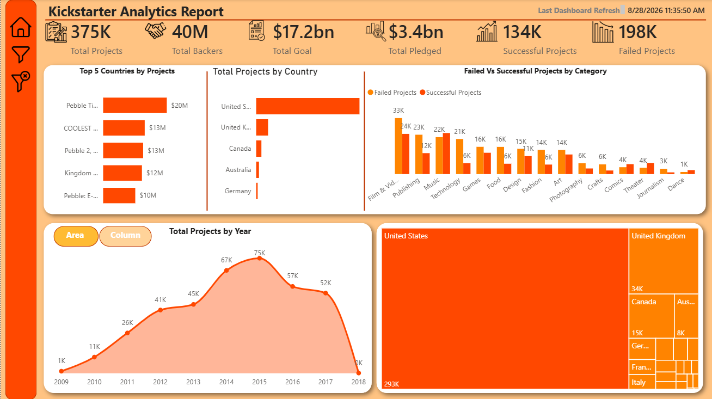
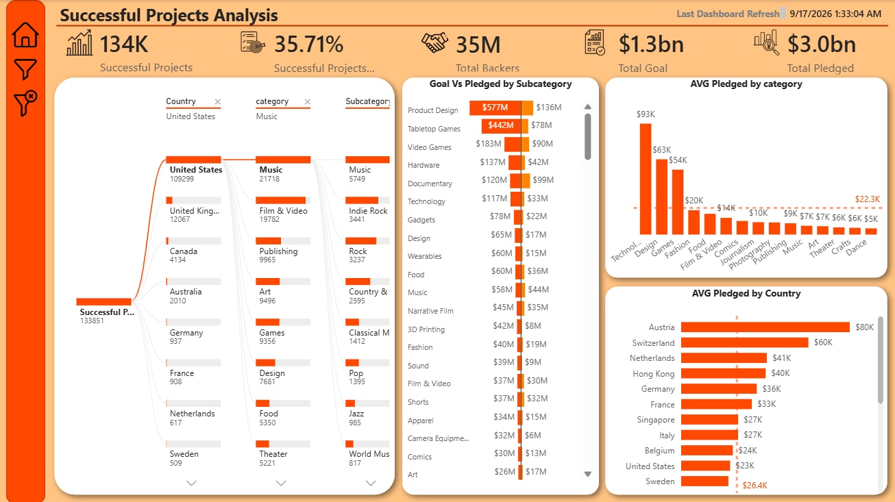
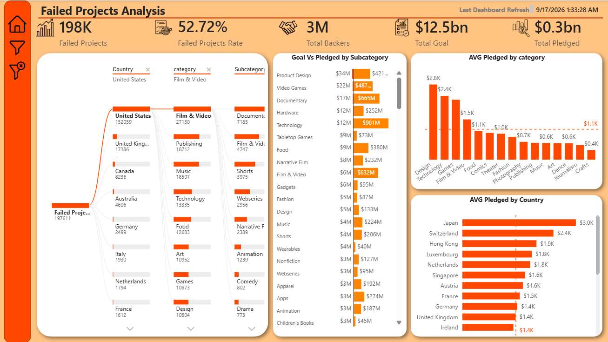
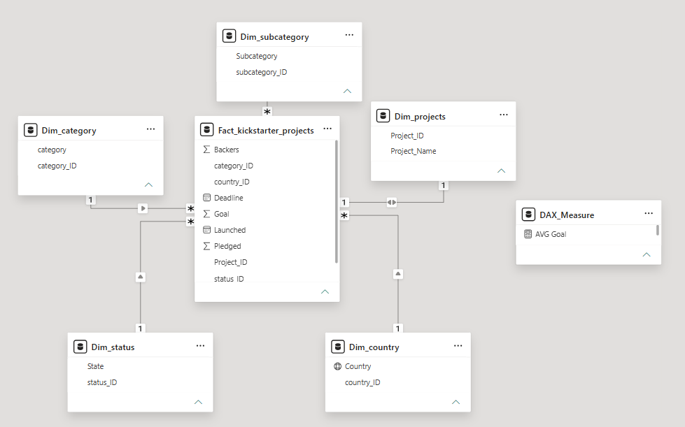

# 🚀 Kickstarter Crowdfunding Analytics & Performance Dashboard

---

## 📌 Executive Summary & Project Overview
This project presents an in-depth exploratory and diagnostic business intelligence dashboard analyzing **375,000+ crowdfunding campaigns** launched on **Kickstarter**. Built with **Power BI Desktop**, the report tracks **$3.4 Billion in pledged capital** against **$17.2 Billion in funding goals**, analyzing success drivers, failure patterns, backer community dynamics, and geographic concentration across global markets.
---

## 🎯 Global Key Performance Indicators (KPIs)
* **Total Projects Analyzed:** 375K Campaigns
* **Total Funding Goal:** $17.2 Billion
* **Total Capital Pledged:** $3.4 Billion
* **Total Backers Community:** 40 Million Backers
* **Successful Projects:** 134K Campaigns (35.71% Success Rate)
* **Failed Projects:** 198K Campaigns (52.72% Failure Rate)
* **Canceled / Suspended / Live:** ~39K Campaigns (10.34%)
  ---

## 🔍 Multi-Page Dashboard Architecture

### 1. Executive Overview & Macro Trends
* **Historical Velocity:** Project launches grew rapidly from 1K in 2009 to a peak of **75K projects in 2015**, stabilizing around 52K–57K annually.
* **Category Volume:** **Film & Video** (33K failed, 24K successful) and **Publishing** lead in total project volume, while **Music** achieves the highest volume parity with successes exceeding failures.
* **Top Funded Outliers:** Pebble Time ($20M), COOLEST COOLER ($13M), and Pebble 2 ($13M) lead historical campaign capital.

### 2. Successful Projects Analysis (134K Projects | $3.0B Pledged)

* **High-Value Categories:** **Technology** and **Design** command the highest average pledges per campaign ($93K and $63K respectively).
* **Capital Density:** **Product Design** ($577M pledged vs $136M goal) and **Tabletop Games** ($442M pledged vs $78M goal) massively surpassed funding thresholds.
* **Global Backing Outliers:** Campaigns from **Austria** ($80K) and **Switzerland** ($60K) generated the highest average pledge per campaign.

### 3. Failed Projects Analysis (198K Projects | $12.5B Unrealized Goals)

* **Unrealistic Goal Setting:** Failed campaigns set goals totaling **$12.5 Billion** but secured only **$0.3 Billion** in pledges.
* **High-Risk Subcategories:** **Technology ($901M goal vs $12M pledged)** and **Video Games ($487M goal vs $22M pledged)** showed the widest gap between ambition and market validation.
* **Root-Cause Attribution:** Root cause analysis via Decomposition Tree indicates **Film & Video**, **Publishing**, and **Music** suffer from high supply but low backer conversion in US and UK markets.

### 4. Backers & Community Engagement Analysis (40M Backers)

* **Community Distribution:** The **United States** accounts for **33 Million (82.5%)** of total backers, followed by the **United Kingdom (3M)**.
* **Backer Conversion:** **88.4% of total backers (35M)** supported campaigns that successfully met their goals, proving that backer volume is the definitive leading indicator of success.
* **Top Backer Niches:** **Games (11M backers)** and **Design (7M backers)** drive the largest community engagement.
---

## 🧩 Data Architecture & Modeling
The dashboard is built on a clean **Star Schema** with single-direction 1-to-many relationships centered around a single core Fact table:

* **Fact Table:** `Fact_kickstarter_projects` (Backers, Goal, Pledged, Launched Date, Deadline Date, Keys)
* **Dimension Tables:**
  * `Dim_category` (Category details)
  * `Dim_subcategory` (Subcategory hierarchy)
  * `Dim_projects` (Project ID and Project Name)
  * `Dim_status` (State: Successful, Failed, Canceled, Live, Suspended)
  * `Dim_country` (Country geographical data)
  * `DAX_Measure` (Centralized measures repository)
 
---

## 📐 Key DAX Calculations

Total Projects = COUNTROWS('Fact_kickstarter_projects')

Total Pledged = SUM('Fact_kickstarter_projects'[Pledged])

Total Goal = SUM('Fact_kickstarter_projects'[Goal])   

Success Rate % = 
DIVIDE(
    CALCULATE([Total Projects], 'Dim_status'[State] = "Successful"),
    [Total Projects],
    0
)

AVG Pledged = DIVIDE([Total Pledged], [Total Projects], 0)
---

## 💡 Strategic Takeaways for Campaign Creators
1. **Calibrate Goal Realism:** Setting over-inflated funding targets is the #1 driver of failure; tech campaigns with goals exceeding $500K suffer the highest failure rate.
2. **Focus on Day-1 Backer Momentum:** Since 88.4% of all backer volume concentrates in successful campaigns, pre-launch audience building is mandatory.
3. **Capitalize on Proven Niches:** **Tabletop Games** and **Product Design** demonstrate the healthiest goal-to-pledged conversion ratios.

---

## 📥 How to Run Locally
1. Clone or download this repository.
2. Ensure you have **Power BI Desktop** installed.
  3. Open the [Kickstarter_Analytics.pbix](Kickstarter_Analytics.pbix) file from the repository to explore the dynamic filters, bookmarks, and cross-filtering.

